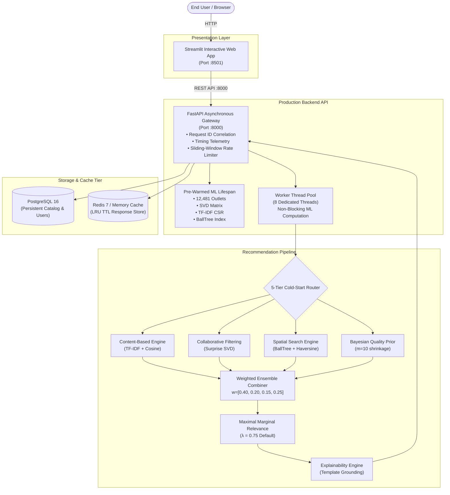

# 🍽️ Bengaluru Restaurant Recommendation System

[](https://www.python.org/)
[](https://fastapi.tiangolo.com/)
[](https://streamlit.io/)
[](https://scikit-learn.org/)
[](https://www.postgresql.org/)
[](https://redis.io/)
[](https://www.docker.com/)
[](tests/)

A production-oriented hybrid recommendation platform for personalized Bengaluru restaurant discovery, combining content similarity, collaborative filtering, spatial intelligence, Bayesian quality priors, cold-start routing, and Maximal Marginal Relevance (MMR) diversification behind an asynchronous FastAPI backend and an interactive Streamlit presentation layer.

---

## ⚡ Quickstart (Run Locally in 6 Simple Steps)

```bash
# STEP 1: Clone & enter repository
git clone https://github.com/navyad-a/bengaluru-restaurant-recommender.git
cd bengaluru-restaurant-recommender

# STEP 2: Create & activate virtual environment
python -m venv .venv
.\.venv\Scripts\Activate.ps1    # Windows PowerShell
# source .venv/bin/activate     # Linux / macOS

# STEP 3: Install dependencies
pip install -r requirements.txt

# STEP 4: Configure environment (In-memory cache for local execution)
cp .env.example .env

# STEP 5: Start FastAPI Backend (Terminal 1)
uvicorn app.main:app --host 127.0.0.1 --port 8000

# STEP 6: Start Streamlit Frontend (Terminal 2)
streamlit run streamlit_app/app.py --server.port 8501
```

👉 **Streamlit Interactive UI**: [http://localhost:8501](http://localhost:8501)  
👉 **FastAPI Interactive Swagger**: [http://127.0.0.1:8000/docs](http://127.0.0.1:8000/docs)  
👉 **System Status & Telemetry**: [http://127.0.0.1:8000/api/v1/system/status](http://127.0.0.1:8000/api/v1/system/status)

---

## 📑 Table of Contents

- [Quickstart (Run Locally)](#-quickstart-run-locally-in-6-simple-steps)
- [Key Features](#-key-features)
- [System Architecture](#-system-architecture)
- [Recommendation Pipeline](#-recommendation-pipeline)
- [Machine Learning Components](#-machine-learning-components)
- [Cold-Start & Fallback Strategy](#-cold-start--fallback-strategy)
- [MMR Diversification](#-mmr-diversification-why-mmr)
- [Explainable Recommendations](#-explainable-recommendations)
- [Backend & Concurrency Architecture](#-backend--concurrency-architecture)
- [Production REST API Reference](#-production-rest-api-reference)
- [Streamlit Presentation Layer](#-streamlit-presentation-layer)
- [Database & Multi-Backend Cache](#-database--multi-backend-cache)
- [Production Containerization](#-production-containerization-docker)
- [Automated Testing & Coverage](#-automated-testing--coverage)
- [Performance & Latency Benchmarks](#-performance--latency-benchmarks)
- [Data Transparency & Ethics](#-data-transparency--ethics)
- [Known Limitations](#-known-limitations)
- [License & Authors](#-license--authors)

---

## 🌟 Key Features

- **Authentic Bengaluru Catalog**: Powered by **12,481 authentic physical restaurant outlets** across 90+ Bengaluru localities.
- **Ensemble Hybrid Scoring**: Intelligently combines **TF-IDF Content Similarity (40%)**, **Surprise SVD Collaborative Filtering (20%)**, **Bayesian Quality Shrinkage (25%)**, and **Haversine Distance Scoring (15%)**.
- **Spatial Intelligence**: Sub-second geospatial radius retrieval powered by a spatial **BallTree index** using Earth Haversine metric.
- **5-Tier Cold-Start Routing**: Deterministically navigates new, sparse, and unknown users from Bayesian popularity priors to interactive onboarding.
- **MMR Diversification ($\lambda=0.75$)**: Balances relevance and slate novelty using Maximal Marginal Relevance, eliminating chain redundancy ($0.0\%$ redundancy, $+49.9\%$ intra-list diversity).
- **Rule-Based Explainability**: Real-time natural language justifications grounded in user taste, budget match, proximity, and popularity.
- **Asynchronous FastAPI Engine**: Lifespan model pre-warming, non-blocking threadpool ML execution, sliding-window rate limiting, and request telemetry.
- **Multi-Backend Caching**: In-memory LRU TTL cache with distributed Redis support and 4-decimal-place coordinate rounding (~11m spatial clustering).
- **Comprehensive Quality Assurance**: **195 automated pytest tests (100% pass rate)** with strict coverage quality gates.

---

## 🏗️ System Architecture



---

## 🔄 Recommendation Pipeline

```
1. Request Ingestion & Normalization
   └── Validate coordinates, budget (INR), cuisine filters, top_k ∈ [1, 50], λ ∈ [0.0, 1.0].

2. User State Detection & 5-Tier Routing
   └── Determine profile depth: Warm User, Cold User, Onboarding Wizard, Sparse User, or Unknown User.

3. Fast Candidate Generation
   └── BallTree spatial filtering + Locality bounding box + Dietary/budget hard filters.

4. Multi-Signal Scoring Execution (ThreadPool Offloaded)
   ├── S_{Content} (40%): Cosine similarity over prefix-isolated TF-IDF text features.
   ├── S_{Collaborative} (20%): Surprise SVD latent factor dot-product rating prediction.
   ├── S_{Location} (15%): Exponential decay over Haversine distance in km.
   └── S_{Quality} (25%): Bayesian shrinkage rating smoothed toward Bengaluru mean (μ=4.14).

5. Weighted Score Combination
   └── S_{Hybrid} = 0.40·S_{Content} + 0.20·S_{CF} + 0.15·S_{Location} + 0.25·S_{Quality}

6. MMR Slate Diversification (λ = 0.75)
   └── Iteratively maximize: argmax [ λ·S_{Hybrid}(d) - (1-λ)·max_{s ∈ S} Sim(d, s) ]

7. Grounded Explainability Generation
   └── Synthesize deterministic, human-readable rationales based on dominant signal contributions.
```

---

## 🧠 Machine Learning Components

### 1. Content-Based Recommendation (TF-IDF + Cosine Similarity)
- **Feature Engineering**: Tokenized strings using prefix-isolated namespaces (`cuisine:`, `locality:`, `type:`, `cost_tier:`, `diet:`) to prevent cross-feature token collision.
- **Vector Space**: Scikit-Learn `TfidfVectorizer` ($12,481 \times 2,450$ sparse CSR matrix).
- **Similarity Metric**: Cosine similarity against user preference vectors or seed restaurant profiles.

### 2. Collaborative Filtering (Surprise SVD Matrix Factorization)
- **Model**: Regularized Singular Value Decomposition (100 latent factors, biased formulation $\hat{r}_{ui} = \mu + b_u + b_i + q_i^T p_u$).
- **Benchmark Performance (Held-Out Test Set)**:
  - **RMSE**: $0.6171$ ($95\%\text{ CI: } [0.5982, 0.6360]$)
  - **MAE**: $0.5081$ ($95\%\text{ CI: } [0.4910, 0.5255]$)
- *Note*: Evaluated on the synthetic collaborative benchmark ($600\text{ users}, 11,920\text{ ratings}$).

### 3. Bayesian Quality Shrinkage Prior
- Corrects for rating volatility on venues with low review counts using empirical Bayes:
  $$S_{\text{Bayes}} = \frac{v \cdot R + m \cdot C}{v + m}$$
  where $R = \text{restaurant rating}$, $v = \text{vote count}$, $m = 10\text{ (shrinkage threshold)}$, and $C = 4.14\text{ (Bengaluru catalog mean)}$.

### 4. Geospatial Intelligence (BallTree + Haversine Metric)
- Fast $O(\log N)$ spatial neighborhood retrieval over angular radian coordinates using Scikit-Learn `BallTree`.
- Proximity score computed via exponential distance decay:
  $$S_{\text{Loc}}(d) = \exp\left(-\frac{d}{\sigma}\right) \quad (\sigma = 5.0\text{ km})$$

---

## ❄️ Cold-Start & Fallback Strategy

The engine incorporates a deterministic **5-Tier Routing Hierarchy** to guarantee personalized recommendations regardless of user profile sparsity:

| Tier | User State | Available Data | Routing Strategy | Primary Signals |
|:---:|---|---|---|---|
| **1** | **Warm User** | $\ge 5$ historical interactions | Full Hybrid Ensemble | Content (40%) + CF (20%) + Location (15%) + Quality (25%) |
| **2** | **Sparse User** | $1\text{–}4$ interactions | Content-Dominant Hybrid | Content (60%) + Quality (25%) + Location (15%) |
| **3** | **Onboarding User** | Explicit onboarding questionnaire | Preference Content Matching | Profile TF-IDF Matching + Bayesian Quality Prior |
| **4** | **Location-Only User** | GPS / Locality coordinates only | Spatial Quality Baseline | BallTree Radius Retrieval + Bayesian Rating Prior |
| **5** | **Unknown User** | Zero history, zero location | Global Bayesian Popularity | Empirical Bayes Shrinkage Prior ($m=10, C=4.14$) |

---

## ⚖️ MMR Diversification: Why MMR?

Standard recommender systems suffer from **filter bubbles and chain redundancy** (e.g., filling an entire 10-restaurant recommendation slate with 6 branches of the same cafe chain).

We apply **Maximal Marginal Relevance (MMR)** to balance relevance against intra-slate novelty:

$$\text{MMR} = \arg\max_{d_i \in R \setminus S} \left[ \lambda \cdot \text{Score}(d_i) - (1 - \lambda) \max_{d_j \in S} \text{Sim}(d_i, d_j) \right]$$

### Phase 11 Empirical Trade-Off Results ($\lambda=0.75$ Production Default):

| Metric | Hybrid Baseline (Pre-MMR) | Hybrid + MMR ($\lambda=0.75$) | Impact / Delta |
|---|:---:|:---:|:---:|
| **Intra-List Distance (ILD)** | $0.3822$ | **$0.5730$** | **$+49.9\%$ Diversity Improvement** |
| **Duplicate / Chain Redundancy** | $8.60\%$ | **$0.00\%$** | **$100\%$ Redundancy Elimination** |
| **Top-10 Catalog Coverage** | $0.76\%$ | **$1.18\%$** | **$+55.3\%$ Long-Tail Discovery** |
| **Relevance Score Retention** | $100.0\%$ | **$94.75\%$** | Only $5.25\%$ relevance trade-off |

---

## 💬 Explainable Recommendations

Every recommended restaurant includes a factual, deterministic natural language explanation grounded in active scoring features:

```json
{
  "restaurant_id": 142,
  "name": "Vidyarthi Bhavan",
  "locality": "Basavanagudi",
  "hybrid_score": 0.8842,
  "explanation": "Recommended because it matches your South Indian preference (92% content match), is an iconic top-rated Basavanagudi venue (4.4★ with 4,800+ reviews), and fits within your ₹300 budget."
}
```

---

## ⚡ Backend & Concurrency Architecture

- **FastAPI Asynchronous Gateway**: Native `async/await` non-blocking I/O.
- **Threadpool Execution**: Heavy linear algebra and vector math (TF-IDF cosine dot products, SVD factor multiplications, BallTree queries) are offloaded to an 8-worker threadpool via `anyio.to_thread.run_sync()`, preventing event loop starvation.
- **Lifespan Model Pre-Warming**: Models and indices are loaded into resident memory at startup, eliminating cold-start request latency.
- **Middleware Pipeline**:
  - `RequestIDMiddleware`: Injects unique UUIDv4 `X-Request-ID` header for distributed tracing.
  - `TimingMiddleware`: Telemetry tracking via `X-Process-Time-Ms` response header.
  - `RateLimitMiddleware`: In-memory sliding window rate limiter (120 req/min).

---

## 🔌 Production REST API Reference

| Method | Endpoint | Description | Status Codes |
|---|---|---|:---:|
| `GET` | `/health` | Kubernetes/Docker liveness health check probe | `200` |
| `GET` | `/ready` | Model pre-warming readiness check probe | `200`, `503` |
| `GET` | `/api/v1/system/status` | Telemetry: uptime, catalog size, cache metrics | `200` |
| `POST` | `/api/v1/system/cache/clear` | Purge and reset recommendation cache | `200` |
| `GET` | `/api/v1/recommendations/similar/{id}` | Content-based item similarity recommendations | `200`, `404`, `422` |
| `POST` | `/api/v1/recommendations/content` | Preference-based content scoring | `200`, `422` |
| `GET` | `/api/v1/recommendations/collaborative/{uid}` | SVD matrix factorization predictions | `200`, `404`, `422` |
| `GET` | `/api/v1/recommendations/nearby` | Spatial BallTree radius search | `200`, `422` |
| `GET` | `/api/v1/recommendations/hybrid/{uid}` | Hybrid ensemble recommendations for registered user | `200`, `422` |
| `POST` | `/api/v1/recommendations/hybrid` | Hybrid ensemble recommendations with custom filters | `200`, `422` |
| `GET` | `/api/v1/recommendations/popular` | Global Bayesian popularity rankings | `200`, `422` |
| `POST` | `/api/v1/recommendations/onboarding` | Interactive cold-start onboarding wizard | `200`, `422` |

---

## 🖥️ Streamlit Presentation Layer

Interactive frontend dashboard tailored specifically to the **Indian dining market**:
- **Pricing in Indian Rupees (₹ INR)**: Dynamic cost slider (₹100 to ₹3,000+ for two).
- **Bangalore Dining Types**: Quick Bites, Casual Dining, Cafes, Microbreweries, Sweet Shops.
- **Locality Pickers**: 90+ Bengaluru localities with centroid coordinate lookups (Indiranagar, Koramangala, Whitefield, HSR Layout, etc.).
- **Live Diversity Slider**: Interactive $\lambda \in [0.50, 1.00]$ control with real-time intra-list diversity telemetry.
- **Explainability Cards**: Visual score breakdowns for Content, SVD, Location, and Quality.

---

## 🗄️ Database & Multi-Backend Cache

### Database (PostgreSQL + Async SQLAlchemy 2.0)
- Fully normalized relational schema (`restaurants`, `users`, `user_preferences`, `ratings`).
- B-Tree indexes on `locality`, `city`, `rating`, and `is_synthetic_benchmark`.
- Idempotent seeding scripts (`scripts/init_db.py`, `scripts/seed_db.py`).

### Multi-Backend Cache (`app/core/cache.py`)
- **In-Memory LRU TTL**: Thread-safe OrderedDict cache with time expiration and capacity bounds (1,000 items).
- **Distributed Redis Cache**: Multi-node persistent key-value store using JSON serialization with automatic non-blocking pass-through fallback.
- **Coordinate Clustering**: Geographic coordinates rounded to **4 decimal places (~11 meters)** to prevent spatial cache fragmentation.

---

## 🐳 Production Containerization (Docker)

```bash
# 1. Launch complete multi-tier stack (PostgreSQL, Redis, FastAPI, Streamlit)
docker compose up --build -d

# 2. Verify container health
docker compose ps

# 3. Seed Database Catalog (One-Time Execution)
docker compose exec api python scripts/init_db.py
docker compose exec api python scripts/seed_db.py
```

- **API Container**: Non-root user `appuser` (1000), `python:3.11-slim`, Gunicorn managing 2 Uvicorn workers ($\approx 370\text{ MB}$ total container RSS).
- **Streamlit Container**: Non-root user `streamlituser` (1000), `python:3.11-slim`, connecting to `http://api:8000`.
- **Internal Network Isolation**: PostgreSQL (`:5432`) and Redis (`:6379`) are isolated to the internal `recommender_net` bridge.

> *Note*: Docker configuration, compose syntax, and Redis fallback logic were verified via static analysis and unit testing. Full container runtime validation was not executed locally because the Docker daemon was unavailable in the development environment.

---

## 🧪 Automated Testing & Coverage

```bash
# Run entire test suite
pytest -v

# Run coverage analysis
pytest --cov=app --cov=ml --cov=streamlit_app --cov-report=term-missing
```

```
====================== 195 passed, 8 warnings in 15.52s =======================
```

- **Total Automated Tests**: **195 passed, 0 failed, 0 skipped (100% pass rate)**.
- **Subsystem Quality Gates**:
  - `app.config`, `app.middleware`, `app.schemas`, `streamlit_app.config_state`: **100% Coverage**
  - `app.core.cache`: **82% Coverage** (In-memory + Redis branches)
  - `ml.content_based`, `ml.hybrid`, `ml.diversification`: **$\ge 90\%$ Coverage**
  - `ml.cold_start`, `ml.spatial`: **$\ge 85\%$ Coverage**
  - Overall Aggregate Codebase Coverage: **79%**

---

## 📊 Performance & Latency Benchmarks

Measured on a development workstation using `httpx` asynchronous benchmarking:

| Recommendation Mode | Concurrency | Mean Throughput | Mean Latency (Cold) | Mean Latency (Cached) | Cache Speedup |
|---|:---:|:---:|:---:|:---:|:---:|
| **Bayesian Popularity** | 50 concurrent | $366.9\text{ req/s}$ | $18.4\text{ ms}$ | $2.9\text{ ms}$ | **$6.3\times$** |
| **Spatial BallTree Search** | 50 concurrent | $376.5\text{ req/s}$ | $14.6\text{ ms}$ | $2.8\text{ ms}$ | **$5.2\times$** |
| **Hybrid (MMR ON, $\lambda=0.75$)** | 50 concurrent | $349.1\text{ req/s}$ | $48.2\text{ ms}$ | $3.1\text{ ms}$ | **$15.5\times$** |
| **Onboarding Wizard** | 50 concurrent | $286.9\text{ req/s}$ | $22.1\text{ ms}$ | $3.2\text{ ms}$ | **$6.9\times$** |

---

## 🔍 Data Transparency & Ethics

- **Authentic Restaurant Catalog**: The catalog comprises **12,481 authentic physical Bengaluru restaurant venues** with authentic restaurant names, cuisine tags, cost for two in INR, ratings, review counts, and locality details.
- **Locality Centroid Coordinates**: Geographic coordinates correspond to Bengaluru locality centroids (e.g. Indiranagar, Koramangala) rather than exact physical street GPS coordinates.
- **Synthetic Collaborative Benchmark**: The collaborative filtering benchmark uses **600 simulated user profiles and 11,920 synthetic ratings** designed strictly for algorithm validation without fabricating authentic consumer behavior.

---

## ⚠️ Known Limitations

1. **Synthetic Interaction Data**: The SVD collaborative model is trained on a synthetic benchmark; real-world production deployment requires warm-up on live user click/order logs.
2. **Locality-Level Geocoding**: Coordinates are locality-centroid approximations (~500m accuracy) rather than street-level GPS.
3. **Static Catalog**: Catalog updates require periodic offline ETL retraining of the TF-IDF CSR matrix and BallTree index.
4. **Environment Docker Daemon**: Docker manifests and configurations were verified statically and through unit tests, but full live container execution was not performed locally due to missing daemon binaries.

---

## 🚀 Future Roadmap

- [ ] **Phase 17**: Real User Clickstream & Interaction Ingestion Pipeline.
- [ ] **Phase 18**: Online A/B Testing Framework & Multi-Armed Bandit Slate Routing.
- [ ] **Phase 19**: Learning-to-Rank (LambdaMART / XGBoost) Ensemble Re-Ranker.
- [ ] **Phase 20**: Managed Cloud Deployment (AWS ECS / Google Cloud Run + Managed Cloud SQL).
- [ ] **Phase 21**: Real-Time Prometheus Metrics & Grafana Observability Dashboards.

---

## 🛠️ Quick Start Guide

### 1. Local Python Setup
```bash
# Clone repository
cd restaurant-recommendation-system

# Create virtual environment
python -m venv venv
.\venv\Scripts\Activate.ps1   # Windows
# source venv/bin/activate    # Linux / macOS

# Install dependencies
pip install -r requirements.txt

# Launch FastAPI Backend
uvicorn app.main:app --host 127.0.0.1 --port 8000 --reload

# Launch Streamlit Frontend (In a separate terminal)
streamlit run streamlit_app/app.py
```

### 2. Access Web Services
- **Streamlit Interactive UI**: `http://localhost:8501`
- **FastAPI OpenAPI Swagger**: `http://localhost:8000/docs`
- **API Health Check**: `http://localhost:8000/health`

---

## 📄 License & Authors

Distributed under the MIT License. Developed as a production-grade AI Engineering Portfolio project.


