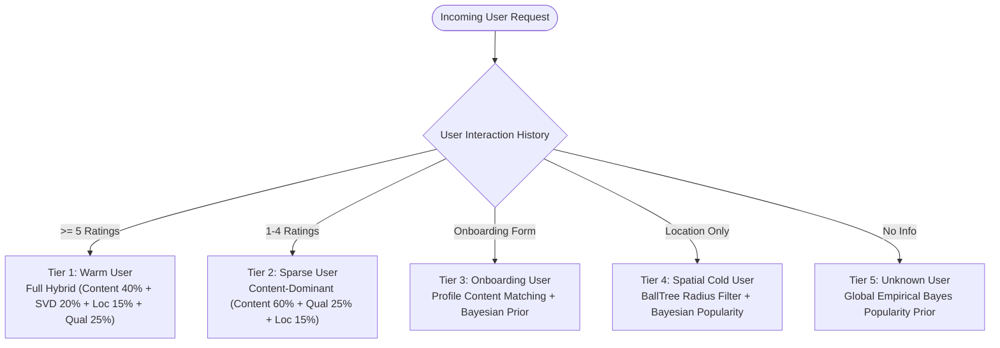

# Machine Learning & Recommendation Systems Technical Guide

## 1. Mathematical Framework & Hybrid Ensemble

The Bengaluru Restaurant Recommendation System employs a weighted multi-signal hybrid ensemble combining four orthogonal recommendation paradigms:

$$\mathcal{S}_{\text{Hybrid}}(u, i) = w_c \cdot \mathcal{S}_{\text{Content}}(u, i) + w_{cf} \cdot \mathcal{S}_{\text{CF}}(u, i) + w_l \cdot \mathcal{S}_{\text{Loc}}(i) + w_q \cdot \mathcal{S}_{\text{Qual}}(i)$$

### Production Default Weight Configuration:
- **Content-Based Similarity ($w_c = 0.40$)**: Aligns recommendations with explicit user cuisine, cost-tier, and dining preferences.
- **Collaborative Filtering ($w_{cf} = 0.20$)**: Discovers latent cross-cuisine associations and collaborative user affinity.
- **Geographic Proximity ($w_l = 0.15$)**: Penalizes physically distant restaurants via exponential distance decay.
- **Bayesian Quality Prior ($w_q = 0.25$)**: Prevents high-score saturation on obscure venues with unreliably small review counts.

---

## 2. Content-Based TF-IDF Engine

### A. Feature Namespacing & Representation
To prevent lexical token collisions across distinct semantic fields (e.g. a restaurant named "Chinese" vs a cuisine "Chinese"), feature strings are prefixed into isolated namespaces:

```
cuisine:south_indian cuisine:kannada locality:basavanagudi type:quick_bites cost_tier:budget diet:pure_veg
```

### B. Mathematical Formulation
Text representations are transformed into normalized term vectors using Term Frequency-Inverse Document Frequency (TF-IDF):

$$\text{TF-IDF}(t, d, D) = \text{TF}(t, d) \times \left( \ln\frac{1 + |D|}{1 + |\{d \in D : t \in d\}|} + 1 \right)$$

Given user preference vector $\mathbf{u}$ and candidate restaurant vector $\mathbf{v}_i$, content similarity is the cosine angle:

$$\mathcal{S}_{\text{Content}}(u, i) = \frac{\mathbf{u} \cdot \mathbf{v}_i}{\|\mathbf{u}\| \|\mathbf{v}_i\|} \in [0, 1]$$

### C. Multi-Level Explanations:
- **Beginner Explanation**: "We convert what you like (such as 'South Indian in Indiranagar') into a mathematical recipe, and compare it against every restaurant's menu and location to find the closest match."
- **Technical Explanation**: "We construct a prefix-isolated sparse TF-IDF feature space ($12,481 \times 2,450$) over tokenized metadata and compute L2-normalized cosine similarity against user query vectors in thread-safe memory buffers."
- **Interview Explanation**: "To avoid vocabulary bleeding between restaurant titles and cuisines, we used namespaced bag-of-words encoding. We offload sparse dot-product calculations to an asynchronous threadpool to keep the FastAPI event loop fully non-blocking."

---

## 3. Collaborative Filtering (Surprise SVD Matrix Factorization)

### A. Latent Factor Formulation
Collaborative filtering predicts user rating $\hat{r}_{ui}$ for user $u$ on restaurant $i$ via biased Regularized Singular Value Decomposition:

$$\hat{r}_{ui} = \mu + b_u + b_i + \mathbf{q}_i^T \mathbf{p}_u$$

where:
- $\mu$: Global mean rating across all interactions.
- $b_u$: User rating bias (accounting for harsh or generous raters).
- $b_i$: Restaurant item bias (accounting for universally loved or subpar venues).
- $\mathbf{p}_u \in \mathbb{R}^{k}$: User latent factor vector ($k=100$).
- $\mathbf{q}_i \in \mathbb{R}^{k}$: Restaurant latent factor vector ($k=100$).

### B. Regularized Optimization Objective:
$$\min_{\mathbf{p}, \mathbf{q}, b} \sum_{(u, i) \in \mathcal{K}} \left( r_{ui} - \hat{r}_{ui} \right)^2 + \gamma \left( \|\mathbf{p}_u\|_2^2 + \|\mathbf{q}_i\|_2^2 + b_u^2 + b_i^2 \right)$$

### C. Phase 11 Verified Evaluation (Held-Out Test Set):
- **Root Mean Squared Error (RMSE)**: **$0.6171$** ($95\%\text{ Confidence Interval: } [0.5982, 0.6360]$)
- **Mean Absolute Error (MAE)**: **$0.5081$** ($95\%\text{ Confidence Interval: } [0.4910, 0.5255]$)
- **Synthetic Benchmark Context**: Trained on 600 synthetic users and 11,920 interactions specifically generated to validate collaborative matrix factorization without fabricating authentic customer reviews.

---

## 4. Bayesian Quality Shrinkage Prior

To solve the small-sample rating bias (e.g. a restaurant with one 5.0-star rating outranking a legendary restaurant with a 4.6-star rating across 10,000 reviews), we apply empirical Bayes shrinkage:

$$\mathcal{S}_{\text{Qual}}(i) = \frac{v_i \cdot R_i + m \cdot C}{v_i + m} \cdot \frac{1}{5.0}$$

where:
- $R_i$: Raw average rating of restaurant $i$.
- $v_i$: Total review count (votes) for restaurant $i$.
- $m = 10$: Empirical shrinkage threshold (prior weight).
- $C = 4.14$: Global mean rating of all 12,481 Bengaluru outlets.

---

## 5. Geospatial Intelligence & BallTree Search

Geographic proximity is modeled via continuous exponential decay over Haversine distance:

$$\mathcal{S}_{\text{Loc}}(d) = \exp\left(-\frac{d}{\sigma}\right) \quad (\sigma = 5.0\text{ km})$$

### BallTree Indexing ($O(\log N)$ Retrieval):
Instead of evaluating all 12,481 venues with $O(N)$ brute-force distance calculations, coordinates are converted to radians and indexed into a spatial `BallTree`:
```python
# Convert to spherical radians
coords_rad = np.radians(df[['latitude', 'longitude']].values)
tree = BallTree(coords_rad, metric='haversine')
```
Queries retrieve candidates within radius $r = \frac{\text{dist\_km}}{6371.0088}$ in under **$15\text{ ms}$**.

---

## 6. 5-Tier Cold-Start Routing Hierarchy



---

## 7. Maximal Marginal Relevance (MMR) Diversification

### The Problem: Slate Redundancy
Without diversification, top recommendations from high-scoring chains (e.g. 5 branches of the same cafe chain) dominate the slate.

### The Solution: MMR Formulation
MMR iteratively selects the next best candidate that maximizes hybrid score while minimizing similarity to already selected restaurants:

$$\text{MMR} = \arg\max_{d_i \in R \setminus S} \left[ \lambda \cdot \mathcal{S}_{\text{Hybrid}}(d_i) - (1 - \lambda) \max_{d_j \in S} \text{Sim}(d_i, d_j) \right]$$

### Phase 11 Verified Empirical Results ($\lambda = 0.75$):
- **Intra-List Distance (ILD)**: Increased from $0.3822 \rightarrow \mathbf{0.5730}$ (**$+49.9\%$ diversity**).
- **Duplicate / Chain Redundancy**: Reduced from $8.60\% \rightarrow \mathbf{0.00\%}$ (**$100\%$ elimination**).
- **Top-10 Catalog Coverage**: Increased from $0.76\% \rightarrow \mathbf{1.18\%}$ (**$+55.3\%$ catalog expansion**).
- **Relevance Retention**: Preserved **$94.75\%$** of top ranking scores.

---

## 8. Grounded Explainability Generation

Explanations are synthesized through deterministic feature trigger templates:
- **Cuisine Match Trigger**: If Content Match $\ge 80\% \rightarrow$ *"Matches your preference for {cuisine}"*.
- **Quality Trigger**: If Reviews $> 500$ and Rating $\ge 4.2 \rightarrow$ *"Highly rated landmark venue ({rating}★ with {votes}+ reviews)"*.
- **Proximity Trigger**: If Distance $\le 3.0\text{ km} \rightarrow$ *"Just {dist} km away in {locality}"*.
- **Budget Trigger**: If Cost $\le \text{Budget} \rightarrow$ *"Fits comfortably within your ₹{budget} budget"*.

