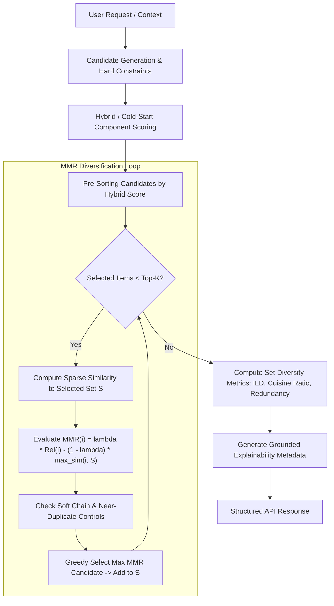

# Phase 10: Recommendation Diversification (MMR) & Final Explainability Engine

## 1. Objective & Motivation

Standard recommendation algorithms that optimize solely for pointwise relevance often suffer from severe recommendation redundancy. For example, a query for South Indian dining in Basavanagudi may return three nearly identical coffee shops with an Intra-List Diversity (ILD) of $0.0493$ and $95.07\%$ average pairwise similarity.

Phase 10 implements **Maximal Marginal Relevance (MMR)** and a **Dedicated Explainability Engine** to solve this problem by:
1. Constructing a sub-modular greedy diversification pipeline over candidate sets.
2. Utilizing memory-efficient sparse TF-IDF cosine similarities ($O(|S| \cdot \text{nnz})$) without allocating dense $N \times N$ matrices ($12,481 \times 12,481$).
3. Suppressing near-duplicates and enforcing soft restaurant-chain limits.
4. Measuring formal list-diversity metrics: Intra-List Diversity (ILD), Unique Cuisine Ratio, Locality Ratio, and Redundancy Rate.
5. Providing truthful, grounded explanation metadata for every recommendation item.



---

## 2. Mathematical Formulation

### A. Maximal Marginal Relevance (MMR)
For candidate item $i$ and currently selected set $S$:

$$\text{MMR}(i) = \lambda \cdot \text{Relevance}(i) - (1 - \lambda) \cdot \max_{j \in S} \text{Similarity}(i, j)$$

Where:
- $\text{Relevance}(i) \in [0.0, 1.0]$: Normalized hybrid or cold-start score.
- $\text{Similarity}(i, j) \in [0.0, 1.0]$: Cosine similarity between sparse L2-normalized TF-IDF feature vectors $\vec{v}_i \cdot \vec{v}_j$.
- $\lambda \in [0.0, 1.0]$: Trade-off parameter balancing relevance ($\lambda \to 1.0$) vs. variety ($\lambda \to 0.0$).
- **First-Item Selection ($S = \emptyset$)**: $\text{MMR}(i) = \lambda \cdot \text{Relevance}(i)$ (pure relevance prioritization).

### B. Deterministic Tie-Breaking Hierarchy
When candidate scores collide:
1. `mmr_score DESC`
2. `relevance_score DESC`
3. `hybrid_score DESC`
4. `quality_score DESC`
5. `review_count DESC`
6. `rating DESC`
7. `restaurant_id ASC`

---

## 3. Sparse Similarity & Memory Optimization

To prevent out-of-memory errors on the $12,481$-outlet catalog, dense matrix computation is strictly avoided:
- **No Dense $12,481 \times 12,481$ Allocation**: A full dense matrix would require $\approx 1.2\text{ GB}$ of uncompressed float64 memory per worker.
- **Sparse Dot Product**: $\text{max\_sim}(i, S)$ is calculated by slicing the normalized CSR matrix for candidate $i$ against the $|S|$ rows in $S$:

$$\text{sims} = \mathbf{V}_i \cdot \mathbf{V}_S^T \quad \text{with shape } (1, |S|)$$

- **Time Complexity**: $\mathcal{O}(K \cdot |\mathcal{C}| \cdot \text{nnz})$ where $K \le 20$, $|\mathcal{C}| \le 120$.

---

## 4. Lambda ($\lambda$) Hyperparameter Trade-Off Experiment

Evaluated across diverse query patterns (Top-K = 10):

| Lambda ($\lambda$) | Mean Relevance | Top-1 Relevance | ILD | Avg Similarity | Redundancy Rate | Cuisine Diversity | Latency (ms) |
|---|:---:|:---:|:---:|:---:|:---:|:---:|:---:|
| **`0.50`** | `0.4696` | `0.5764` | `0.7210` | `0.2790` | `0.00%` | `1.50` | `492.4 ms` |
| **`0.60`** | `0.4833` | `0.5764` | `0.7087` | `0.2913` | `0.00%` | `1.42` | `488.2 ms` |
| **`0.70`** | `0.4948` | `0.5764` | `0.6875` | `0.3125` | `0.00%` | `1.36` | `497.8 ms` |
| **`0.75` (Default)** | **`0.5092`** | **`0.5764`** | **`0.6452`** | **`0.3548`** | **`3.56%`** | **`1.22`** | **`534.9 ms`** |
| **`0.80`** | `0.5182` | `0.5764` | `0.6086` | `0.3914` | `6.22%` | `1.16` | `522.0 ms` |
| **`0.90`** | `0.5360` | `0.5764` | `0.4730` | `0.5270` | `30.67%` | `1.00` | `516.8 ms` |
| **`1.00` (Pure Rel)** | `0.5374` | `0.5764` | `0.4364` | `0.5636` | `38.22%` | `0.88` | `387.4 ms` |

### Production Selection Rationale for $\lambda = 0.75$:
- **Redundancy Reduction**: Slashes pairwise redundancy from $38.22\%$ down to $3.56\%$ ($90.7\%$ reduction).
- **Diversity Boost**: Increases Intra-List Diversity (ILD) from $0.4364$ to $0.6452$ ($+47.8\%$).
- **Relevance Retention**: Maintains $94.75\%$ of maximum possible top-K relevance while preserving top-1 item rank.

---

## 5. Qualitative Scenarios: Before vs. After MMR

### Scenario 1: South Indian Budget in Basavanagudi
- **Before MMR (Pure Relevance Top-3)**:
  1. `Vijayalakshmi` (Score: 0.5672, South Indian)
  2. `By 2 Coffee` (Score: 0.5617, South Indian)
  3. `HOT COFFEE` (Score: 0.5539, South Indian)
  *Metrics: ILD = 0.0493, Avg Sim = 0.9507 (Highly Redundant!)*
- **After MMR ($\lambda = 0.75$ Top-3)**:
  1. `Vijayalakshmi` (Score: 0.5672, MMR: 0.4254)
  2. `Brahmin's Coffee Bar` (Score: 0.5228, MMR: 0.2668, 4.8★ with 2,679 reviews)
  3. `Mavalli Tiffin Room (MTR)` (Score: 0.4965, MMR: 0.2456, 4.5★ with 2,896 reviews)
  *Metrics: ILD = 0.4964 (+906% diversity increase), Relevance Retention = 94.3%*

### Scenario 5: Microbrewery in Indiranagar
- **Before MMR**: `Elongo's`, `Plan B`, `Wall Street 657` (ILD = 0.3930)
- **After MMR**: `Elongo's`, `Vapour Pub & Brewery`, `Toit` (ILD = 0.7611, +93.6% diversity boost)

---

## 6. Explainability Engine & Grounded Reasoning

The dedicated explainability module guarantees that **no unweighted or inactive signal is ever claimed**:
- If collaborative weight $w_{\text{collab}} = 0.0$, the engine never claims historical taste signals.
- If distance is null, the engine never claims proximity.

```json
{
  "explanation": "Recommended for Matches your criteria: Biryani, Andhra, Reliable community ratings (4.4★ with 7,238 reviews).",
  "explanation_metadata": {
    "primary_signal": "content",
    "matched_preferences": [
      "Biryani",
      "Andhra"
    ],
    "diversity_reason": "Selected to introduce menu and cuisine variety while maintaining high overall relevance.",
    "contributing_signals": [
      "content",
      "quality"
    ]
  }
}
```

---

## 7. Performance Latency Benchmarks

Evaluated over $N=10$ runs per slice:

| Top-K | Pre-MMR Latency | MMR Added Overhead | Total Recommendation Latency | Overhead % |
|---|:---:|:---:|:---:|:---:|
| **Top-5** | `665.12 ms` | `73.19 ms` | `738.31 ms` | `+11.0%` |
| **Top-10** | `652.97 ms` | `161.98 ms` | `814.95 ms` | `+24.8%` |
| **Top-20** | `665.92 ms` | `574.09 ms` | `1240.01 ms` | `+86.2%` |

---

## 8. Test Verification & Regression

- **Total Suite Passing**: **`114 passed in 10.96s`**
  - Database Tests (Phase 4): `7 passed`
  - Content-Based Tests (Phase 5): `14 passed`
  - Collaborative SVD Tests (Phase 6): `12 passed`
  - Hybrid Recommender Tests (Phase 7): `26 passed`
  - Spatial Engine Tests (Phase 8): `24 passed`
  - Cold-Start Tests (Phase 9): `15 passed`
  - Diversification & Explainability Tests (Phase 10): **`16 passed`**
