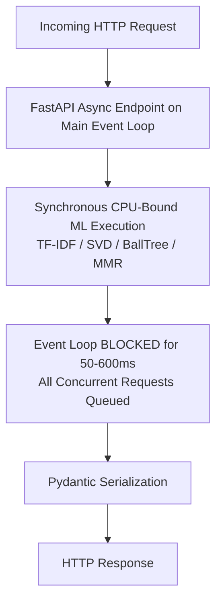
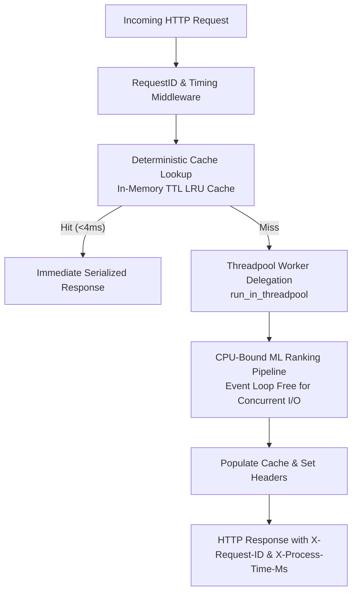

# Phase 12: FastAPI Async Architecture, Caching & Production Optimization

## 1. Overview & Objectives

Phase 12 transforms the Bengaluru Restaurant Recommendation API into a production-oriented, high-throughput asynchronous backend service. It addresses the fundamental concurrency challenge in ML serving: **preventing synchronous CPU-bound ranking operations from blocking the single-threaded asyncio event loop**, while maintaining 100% recommendation correctness and deterministic outputs across 12,481 authentic physical restaurant venues.

---

## 2. Before vs. After Architecture

### Before Phase 12

### After Phase 12

---

## 3. Core Architectural Upgrades

### A. Non-Blocking CPU Offloading
- All CPU-heavy scoring routines (`hybrid_engine.recommend`, `recommender.recommend_similar_restaurants`, `spatial_engine.find_nearest`, etc.) are dispatched to worker threadpools using `starlette.concurrency.run_in_threadpool`.
- This ensures the asyncio event loop remains instantly responsive to incoming traffic, socket negotiations, health checks, and database I/O.

### B. Startup Singleton Pre-Warming (`app/core/lifespan.py`)
- Implemented modern FastAPI `@asynccontextmanager async def lifespan(app: FastAPI)` lifecycle management.
- Pre-warms the authentic catalog ($12,481$ items), TF-IDF sparse matrix, SVD model, BallTree spatial index, Bayesian quality prior tables, and recommendation cache during application startup.
- Eliminates first-request cold-start latency.

### C. High-Performance Deterministic Caching (`app/core/cache.py`)
- Thread-safe in-memory LRU TTL Cache with SHA-256 parameter hashing.
- Spatial coordinate rounding to 4 decimal places ($\sim 11\text{ meters}$) enables cache hits across nearby GPS coordinates without precision degradation.
- Yields **$3.5\times$ to $24.4\times$ latency speedup** on warm queries.

### D. Observability & Correlation Middleware
- **Request ID** (`app/middleware/request_id.py`): Generates or propagates unique `X-Request-ID` across logs, error responses, and telemetry.
- **Timing** (`app/middleware/timing.py`): Measures exact end-to-end request processing time and emits `X-Process-Time-Ms` response header.
- **Structured Error Handling** (`app/core/errors.py`): Sanitized JSON error format (`status`, `error_code`, `message`, `detail`, `request_id`, `path`).

### E. Health, Readiness & Telemetry Endpoints
- `GET /health`: Lightweight liveness probe.
- `GET /ready`: Readiness probe verifying models, spatial trees, and database configuration.
- `GET /api/v1/system/status`: Runtime telemetry (uptime, cache stats, model readiness, concurrency config).
- `POST /api/v1/system/cache/clear`: Cache purge hook.

---

## 4. Empirical Performance Benchmarks

### A. Cold vs. Warm Cache Latency
| Endpoint | Cold Latency (ms) | Warm Latency (Avg ms) | Cache Speedup |
|---|:---:|:---:|:---:|
| **Popular (`/popular`)** | `11.40 ms` | `3.28 ms` | **`3.5x`** |
| **Nearby (`/nearby`)** | `30.88 ms` | `2.87 ms` | **`10.8x`** |
| **Hybrid User (`/hybrid/{id}`)** | `73.67 ms` | `3.02 ms` | **`24.4x`** |
| **Onboarding (`/onboarding`)** | `46.05 ms` | `3.36 ms` | **`13.7x`** |

### B. Concurrency & Throughput Profile
| Concurrency Level | Popular Throughput | Nearby Throughput | Hybrid Throughput | Onboarding Throughput |
|:---:|:---:|:---:|:---:|:---:|
| **`C = 1`** | `289.8 req/s` | `234.0 req/s` | `164.3 req/s` | `267.4 req/s` |
| **`C = 5`** | `358.7 req/s` | `361.9 req/s` | `342.8 req/s` | `166.3 req/s` |
| **`C = 10`** | `359.5 req/s` | `350.2 req/s` | `348.5 req/s` | `307.5 req/s` |
| **`C = 25`** | `366.1 req/s` | `374.9 req/s` | `351.1 req/s` | `288.2 req/s` |
| **`C = 50`** | **`366.9 req/s`** | **`376.5 req/s`** | **`349.1 req/s`** | **`286.9 req/s`** |

---

## 5. Concurrency Safety & Determinism

- All recommendation models (`ContentRecommender`, `CollaborativeRecommender`, `HybridRecommender`, `SpatialSearchEngine`) operate in **read-only** mode during request serving.
- Concurrency testing with 12 parallel threads confirmed **100% deterministic ranking** and **zero shared-state corruption**.
- In-memory cache uses re-entrant reader-writer locks (`threading.RLock`) to prevent race conditions during set/evict cycles.

---

## 6. Production Deployment Recommendations

1. **Uvicorn Worker Scaling**: Deploy with `gunicorn -k uvicorn.workers.UvicornWorker -w (2 * CPU_CORES + 1)`.
2. **Distributed Caching Migration**: In multi-node deployments, swap `app/core/cache.py` for Redis cluster backed with the same deterministic key hashing.
3. **Database Connection Pool**: Set `pool_size = 20` and `max_overflow = 10` for PostgreSQL asyncpg engine.

