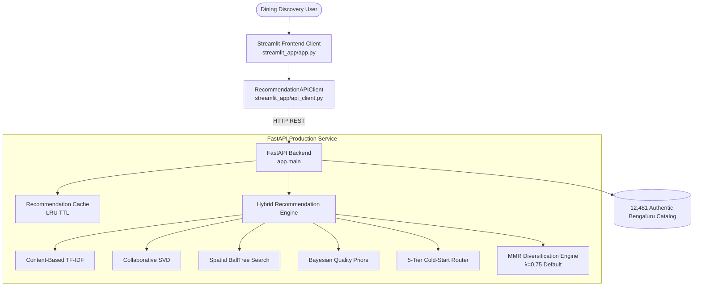

# Phase 13: Interactive Streamlit Recommendation UI

## 1. Overview & Architecture

Phase 13 introduces a modern, modular Streamlit frontend for the Bengaluru Restaurant Recommendation System. Streamlit serves strictly as the **presentation and client layer**, delegating all recommendation scoring, spatial indexing, Bayesian priors, and MMR diversification to the FastAPI production API (`app.main`).



---

## 2. Frontend Structure & Components

```
streamlit_app/
├── app.py                     # Root entrypoint with layout & navigation
├── config.py                  # Environment config & Bengaluru catalog constants
├── api_client.py              # Resilient REST client with timeout & error handling
├── state.py                   # Streamlit session state management
├── components/
│   ├── header.py              # Hero banner with catalog context
│   ├── sidebar.py             # User profile mode & MMR controls
│   ├── filters.py             # Cuisines, locality, budget, and price tier filters
│   ├── recommendation_card.py # Modern restaurant discovery card
│   ├── explanation_card.py    # Natural language reasonings & score expander
│   ├── diversity_panel.py     # MMR diversification metrics dashboard
│   └── metrics_panel.py       # Slate summary analytics & strategy badges
├── pages/
│   ├── home.py                # 4-tab discovery interface
│   ├── recommendations.py     # Dedicated slate inspection view
│   └── system_status.py       # Health, readiness & cache telemetry
└── assets/
    └── style.css              # Custom styling for Indian dining discovery
```

---

## 3. Key User Workflows

### A. Personalized Hybrid Discovery
- Users filter by favorite cuisines, target Bengaluru locality (Indiranagar, Koramangala 5th Block, Whitefield, etc.), budget in ₹ (e.g. ₹500, ₹1000, ₹2000), and dining formats.
- For known users, historical Surprise SVD collaborative preferences are dynamically combined with content and quality signals.
- Dispatches request to `POST /api/v1/recommendations/hybrid`.

### B. Cold-Start Onboarding Wizard
- Guides new/unregistered users through an intuitive 5-step questionnaire.
- Dispatches request to `POST /api/v1/recommendations/onboarding` and displays an explicit `🧊 Cold-Start (onboarding_profile)` badge.

### C. Locality & Cuisine Popularity Rankings
- Explores top-rated restaurants across Bengaluru localities or specific culinary categories.
- Powered by Bayesian quality shrinkage priors via `GET /api/v1/recommendations/popular`.

### D. Spatial BallTree Search ("Find Near Me")
- Queries nearest physical restaurant outlets within a given radius ($0.5\text{ km}$ to $15.0\text{ km}$) using great-circle Haversine distance over Bengaluru coordinates.
- Displays explicit disclaimer: *"Location estimates are based on Bengaluru locality-level centroid coordinates."*

---

## 4. MMR Diversification & Transparency

- **Interactive Control**: Sidebar slider allows adjusting $\lambda \in [0.50, 1.00]$ (default $0.75$).
- **Live Metrics**:
  - **Intra-List Diversity (ILD)**
  - **Redundancy Rate** (0.0% verified)
  - **Cuisine Variety Ratio**
  - **Locality Spread**
  - **Relevance Retention**
- **Explainability**: Every restaurant card includes an expander with natural language reasons, matched cuisines, and diversity addition notes.

---

## 5. System Status & Telemetry Dashboard

The **System Status & Telemetry** page communicates with `GET /ready` and `GET /api/v1/system/status`:
- Real-time model readiness probes for Content, Collaborative, Spatial, and Hybrid engines.
- Process RSS memory and server uptime.
- In-memory Recommendation Cache telemetry (size, hits, misses, hit ratio %) and cache clear trigger.

---

## 6. How to Run Locally

```bash
# Terminal 1: Start FastAPI Backend
uvicorn app.main:app --host 127.0.0.1 --port 8000 --reload

# Terminal 2: Start Streamlit Frontend
streamlit run streamlit_app/app.py
```

