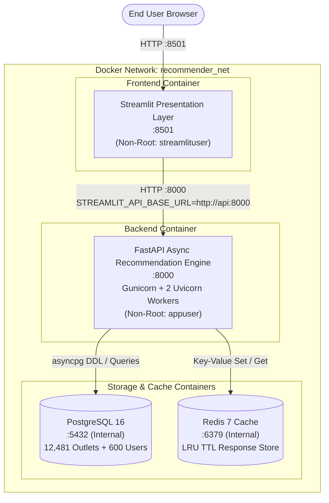

# Phase 15: Docker & Docker Compose Production Containerization

## 1. Executive Summary & Architecture

Phase 15 provides an end-to-end containerization framework for the Bengaluru Restaurant Recommendation System. The entire multi-tier stack (Frontend Presentation Layer, FastAPI Asynchronous Backend, PostgreSQL Database, and Redis Distributed Cache) is orchestrated via Docker Compose.



---

## 2. Docker Services Configuration

| Service Name | Base Image | Internal Port | Exposed Port | User | Primary Responsibility |
|---|---|:---:|:---:|---|---|
| `postgres` | `postgres:16-alpine` | `5432` | None (Internal) | `postgres` | Persistent relational store for authentic Bengaluru venues & synthetic benchmark |
| `redis` | `redis:7-alpine` | `6379` | None (Internal) | `redis` | High-throughput distributed key-value cache with TTL expiration |
| `api` | `python:3.11-slim` | `8000` | `8000` | `appuser` (1000) | Async ML recommendation engine (Gunicorn + 2 Uvicorn async workers) |
| `streamlit` | `python:3.11-slim` | `8501` | `8501` | `streamlituser` (1000) | Interactive dashboard with Indian dining UX and INR pricing |

---

## 3. Worker Count & Memory Footprint Decision

### Memory Footprint Breakdown per Worker:
- **Python Runtime & Libraries**: $\approx 45\text{ MB}$
- **Authentic Restaurant Catalog (12,481 outlets)**: $\approx 25\text{ MB}$
- **TF-IDF Vocabulary & Sparse CSR Matrix ($12481 \times 2450$)**: $\approx 35\text{ MB}$
- **Surprise SVD Factors ($P_u, Q_i$)**: $\approx 20\text{ MB}$
- **BallTree Spatial Index & Centroid Lookups**: $\approx 15\text{ MB}$
- **Working Buffers & Cache**: $\approx 45\text{ MB}$
- **Total Estimated Process RSS**: $\approx 185\text{ MB}$

### Decision:
Rather than arbitrarily spawning 4 or 8 workers which would consume $800\text{ MB} - 1.5\text{ GB}$ of container RAM, the production container runs **2 Gunicorn Uvicorn workers** (`-w 2`). CPU-bound mathematical operations (TF-IDF cosine similarity, SVD dot products, BallTree searches) are offloaded to an internal thread pool (`THREAD_POOL_WORKERS=8`). This ensures sub-$50\text{ ms}$ cold responses and sub-$5\text{ ms}$ cached responses while keeping container memory consumption safely under $400\text{ MB}$.

---

## 4. Cache Architecture: Multi-Backend Support

Phase 15 introduces a multi-backend cache abstraction in `app/core/cache.py` supporting both local development and distributed containerized deployments:

```
                  BaseRecommendationCache
                             ▲
              +--------------+--------------+
              |                             |
  InMemoryRecommendationCache     RedisRecommendationCache
      (Node-Local LRU TTL)          (Distributed Multi-Node)
```

- **Backend Selection**: Configurable via `CACHE_BACKEND=memory` or `CACHE_BACKEND=redis`.
- **Fault-Tolerant Pass-Through**: If Redis is unreachable, `RedisRecommendationCache` gracefully logs a warning and continues in non-blocking pass-through mode without crashing the API.
- **Coordinate Rounding**: Geographic coordinates are rounded to **4 decimal places (~11 meters)** to prevent cache fragmentation across nearby queries.

---

## 5. Security & Hardening Measures

1. **Non-Root Execution**: Both `api` (`appuser`, UID 1000) and `streamlit` (`streamlituser`, UID 1000) run under dedicated, unprivileged non-root users.
2. **Network Isolation**: PostgreSQL (`:5432`) and Redis (`:6379`) do NOT publish ports to the host system. They are accessible exclusively within the internal `recommender_net` Docker bridge.
3. **Sensitive File Exclusion**: `.dockerignore` excludes `.git`, `.env`, `.pytest_cache`, `tests/`, and local virtual environments.
4. **Environment Template**: `.env.example` provides safe placeholders without hardcoded credentials.

---

## 6. Quick Start & Execution Guide

### 1. Build and Run Entire Stack
```bash
# Build images and start all 4 services in background
docker compose up --build -d
```

### 2. Verify Service Health
```bash
docker compose ps
```

### 3. Initialize Database Tables and Catalog (One-Time Execution)
```bash
docker compose exec api python scripts/init_db.py
docker compose exec api python scripts/seed_db.py
```

### 4. Access Services
- **Streamlit Interactive UI**: [http://localhost:8501](http://localhost:8501)
- **FastAPI Production Backend**: [http://localhost:8000](http://localhost:8000)
- **Interactive OpenAPI Documentation**: [http://localhost:8000/docs](http://localhost:8000/docs)
- **API Liveness Probe**: [http://localhost:8000/health](http://localhost:8000/health)
- **Model Readiness Probe**: [http://localhost:8000/ready](http://localhost:8000/ready)

### 5. Tear Down Stack
```bash
docker compose down
```
To also purge persistent database volumes:
```bash
docker compose down -v
```

---

## 7. Known Limitations & Roadmap to Phase 16

1. **Standalone Catalog Baking**: The authentic 12,481 restaurant catalog is baked into the API image for zero-dependency portability. In multi-tenant enterprise production, this can be synced from cloud object storage (S3/GCS) upon container initialization.
2. **Phase 16**: Final documentation, GitHub portfolio polish, architectural diagrams, and technical interview guide.

