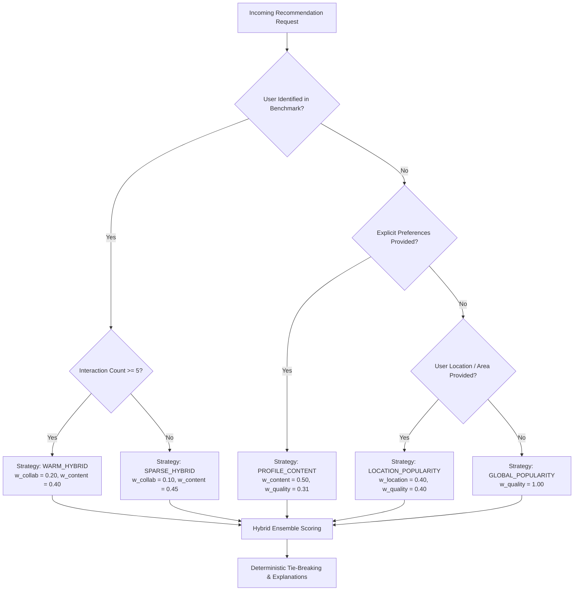

# Phase 9: Cold-Start Strategy & Fallback Intelligence

## 1. Objective & Problem Formulation

The Cold-Start problem is a fundamental challenge in recommendation systems where insufficient historical interactions prevent reliable collaborative filtering. Phase 9 implements a **deterministic, explainable fallback hierarchy** that addresses:

1. **New Users (Zero Historical Ratings)**: Bootstrapped via onboarding questionnaires or Bayesian locality/global popularity priors.
2. **Sparse-History Users (1–4 Ratings)**: Collaborative signal dampened ($w_{\text{collab}} = 0.10$) with boosted content and Bayesian quality weights to prevent overfitting.
3. **Warm Users ($\ge 5$ Ratings)**: Full personalized hybrid ensemble ($w_{\text{content}}=0.40, w_{\text{collab}}=0.20, w_{\text{location}}=0.15, w_{\text{quality}}=0.25$).
4. **Unrated / Newly Listed Restaurants**: Baseline quality imputed from locality cluster priors, preventing starvation in candidate retrieval.
5. **Missing Contextual Signals**: Graceful fallback when coordinates, areas, or explicit preferences are absent.



---

## 2. Decision Routing Taxonomy & Strategy Weights

| Strategy | User State & Context | $w_{\text{content}}$ | $w_{\text{collab}}$ | $w_{\text{location}}$ | $w_{\text{quality}}$ | Fallback Rationale |
|---|---|:---:|:---:|:---:|:---:|---|
| **`WARM_HYBRID`** | Known user with $\ge 5$ ratings + Coords | `0.4000` | `0.2000` | `0.1500` | `0.2500` | Full multi-signal personalized scoring. |
| **`WARM_HYBRID`** | Known user with $\ge 5$ ratings, No Coords | `0.4706` | `0.2353` | `0.0000` | `0.2941` | Location weight redistributed to Content & Quality. |
| **`SPARSE_HYBRID`** | Known user with 1–4 ratings + Coords | `0.4500` | `0.1000` | `0.1500` | `0.3000` | Dampened collaborative weight prevents sparse overfitting. |
| **`SPARSE_HYBRID`** | Known user with 1–4 ratings, No Coords | `0.5294` | `0.1176` | `0.0000` | `0.3530` | Content & Quality prioritized over sparse SVD. |
| **`PROFILE_CONTENT`** | Unknown user with explicit preferences + Coords | `0.5000` | `0.0000` | `0.1875` | `0.3125` | Zero collaborative dependency; matches cuisines & budget. |
| **`LOCATION_POPULARITY`**| Unknown user with locality only | `0.2000` | `0.0000` | `0.4000` | `0.4000` | Localized Bayesian popularity + proximity decay. |
| **`GLOBAL_POPULARITY`**  | Complete cold start (No ID, prefs, location) | `0.0000` | `0.0000` | `0.0000` | `1.0000` | Global city-wide Bayesian popularity ranking. |

---

## 3. Bayesian Popularity Engine Formulation

To balance high ratings against statistical review volume:

$$S_{\text{pop}}(r) = \alpha \cdot S_{\text{quality}}(r) + (1 - \alpha) \cdot \frac{\log(1 + v)}{\log(1 + v_{\max})}$$

Where:
- $S_{\text{quality}}$: Bayesian regularized quality score $\in [0.0, 1.0]$.
- $v$: Restaurant review count.
- $v_{\max}$: Maximum review count in the catalog ($16,832$ votes).
- $\alpha = 0.60$: Balancing coefficient (60% Bayesian quality, 40% log volume).

---

## 4. User Onboarding Bootstrapping

The onboarding handler translates new user questionnaire choices into structured preference vectors:
- **Cuisines**: e.g., `['South Indian', 'Karnataka']`
- **Dining Format**: e.g., `['Quick Bites', 'Cafe']`
- **Area**: e.g., `'Koramangala 5th Block'`
- **Budget**: e.g., `max_cost_for_two = 700`
- **Dietary**: e.g., `is_pure_veg_preferred = True`

Produces instant personalized recommendations via `POST /api/v1/recommendations/onboarding`.

---

## 5. Item Cold-Start & Unrated Imputation

For unrated or newly listed outlets (0 reviews or NaN rating):
- **Locality Prior Imputation**: $\hat{r}_{\text{imputed}} = \mu_{\text{area}}$ (e.g. 3.76★ in Jayanagar, 3.63★ in JP Nagar).
- **Metadata Flags**: `is_unrated: true`, `imputed_rating_prior: 3.76`.
- Enables newly added restaurants to be discovered through Content-Based TF-IDF matching without rating starvation.

---

## 6. Contextual Explainability

| Strategy | Generated Explanation Example |
|---|---|
| **`WARM_HYBRID`** | *"Recommended based on high taste alignment with your dining history, matching cuisine (South Indian), proven customer reviews (4.5★ with 5,000 votes)."* |
| **`SPARSE_HYBRID`** | *"Recommended based on early taste signals from your ratings, matching cuisine (Biryani), solid community rating (4.2★)."* |
| **`PROFILE_CONTENT`** | *"Recommended for matching your preferred cuisines (Biryani, Mughlai), strong community reviews (3.9★ with 89 votes)."* |
| **`LOCATION_POPULARITY`** | *"Top trending & popular choice in Koramangala (4.4★ with 109 community reviews)."* |
| **`GLOBAL_POPULARITY`** | *"Highly rated and most popular dining institution in Bengaluru (4.9★ with 16,832 reviews)."* |

---

## 7. REST API Endpoints

### 1. `GET /api/v1/recommendations/popular`
- **Query Parameters**: `area`, `cuisine`, `max_cost_for_two`, `min_rating`, `top_k`.
```json
{
  "status": "success",
  "scope": "locality: Koramangala",
  "count": 2,
  "recommendations": [
    {
      "restaurant_id": 1420,
      "name": "FreshMenu",
      "popularity_score": 0.6937,
      "rating": 3.9,
      "review_count": 587,
      "area": "Koramangala",
      "cost_for_two_inr": 450
    }
  ]
}
```

### 2. `POST /api/v1/recommendations/onboarding`
- **Payload**: `OnboardingRequest` questionnaire.
- Returns instant bootstrapped recommendations with `strategy: "profile_content"`.

---

## 8. Test Verification & Regression

- **Total Suite Passing**: **`98 passed in 8.31s`**
  - Database Tests (Phase 4): `7 passed`
  - Content-Based Tests (Phase 5): `14 passed`
  - Collaborative SVD Tests (Phase 6): `12 passed`
  - Hybrid Recommender Tests (Phase 7): `26 passed`
  - Spatial Engine Tests (Phase 8): `24 passed`
  - Cold-Start & Fallback Tests (Phase 9): **`15 passed`**
