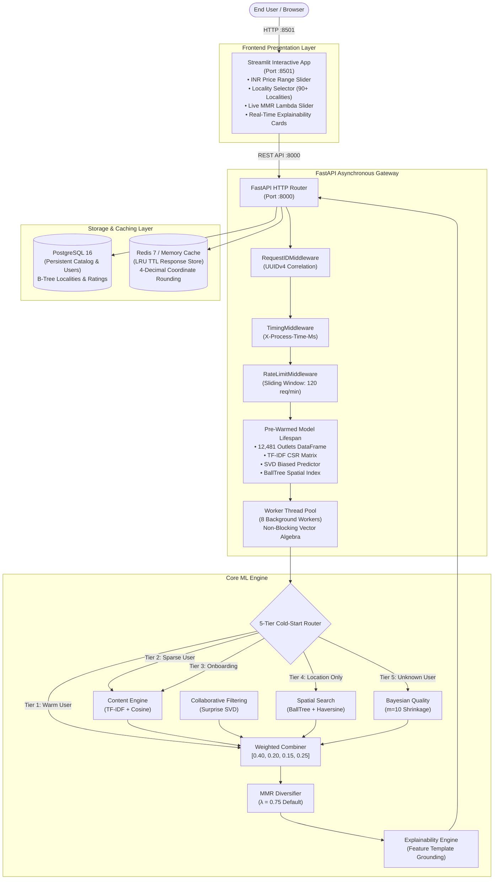

# Project Architecture & System Design Blueprint

## 1. Executive System Overview

The **Bengaluru Restaurant Recommendation System** is an enterprise-ready, multi-tiered recommendation engine specifically engineered for the high-density Indian restaurant ecosystem. It operates as an asynchronous, containerized microservices platform combining content feature modeling, collaborative matrix factorization, geospatial spatial indexing, empirical Bayes rating shrinkage, multi-tier cold-start routing, and Maximal Marginal Relevance (MMR) diversification.

---

## 2. Layer-by-Layer Architectural Breakdown

### A. Presentation Layer (Streamlit)
- **Directory**: `streamlit_app/`
- **Port**: `8501`
- **State Management**: Centralized in `streamlit_app/state.py` using Streamlit's `st.session_state`.
- **API Client**: `ApiClient` in `streamlit_app/api_client.py` executing HTTP REST requests with automatic fallback, error unwrapping, and configurable base URL via `STREAMLIT_API_BASE_URL`.
- **Components**:
  - `header.py`: Hero branding, badges, catalog indicators.
  - `filters.py`: Cuisine selection, budget (₹ INR), delivery/booking checkboxes, locality coordinates.
  - `sidebar.py`: User selection, cold-start profiles, and interactive $\lambda$ diversity tuning.
  - `recommendation_card.py`: Structured restaurant cards showing cost for two, locality, cuisines, rating stars, and distance.
  - `explanation_card.py`: Visual justification breakdown (Content Match %, Quality Score, Distance, Budget Match).
  - `diversity_panel.py`: Real-time Intra-List Distance (ILD) and redundancy diagnostics.
  - `metrics_panel.py`: Response latency telemetry and cache hit status.

---

### B. Production Asynchronous API Gateway (FastAPI)
- **Directory**: `app/`
- **Entrypoint**: `app/main.py`
- **Concurrency & Non-Blocking Design**:
  - Web handlers use native `async def` endpoints.
  - CPU-heavy linear algebra, TF-IDF cosine matrix multiplication, and Surprise SVD dot products are dispatched to an asynchronous threadpool (`anyio.to_thread.run_sync()`), preventing Python event loop blocking.
- **Model Pre-Warming (Lifespan Context)**:
  - `app/core/lifespan.py` initializes all ML engines (TF-IDF vectorizer, CSR matrix, SVD model, BallTree spatial index, catalog DataFrame) on application startup.
  - Guarantees zero request-time initialization lag.
- **Telemetry & Tracing Middleware**:
  - `RequestIDMiddleware`: Guarantees a unique `X-Request-ID` correlation UUID on every request.
  - `TimingMiddleware`: Measures end-to-end request duration and writes `X-Process-Time-Ms`.
  - `RateLimitMiddleware`: Enforces sliding-window rate limiting per client IP (120 requests/minute default).

---

### C. Recommendation Orchestrator & Signal Flow
The core orchestrator (`app/services/recommendation_service.py`) coordinates multi-candidate generation and hybrid ranking:

1. **Candidate Retrieval**:
   - Geographically bounded venues retrieved via `BallTree` ($O(\log N)$).
   - Hard categorical filters applied (e.g., pure vegetarian, max budget in ₹ INR, booking options).
2. **Signal Synthesis**:
   - **Content-Based Similarity**: $S_{\text{Content}}(u, i) = \cos(\mathbf{v}_u, \mathbf{v}_i) \in [0, 1]$
   - **Collaborative Rating**: $S_{\text{CF}}(u, i) = \frac{\hat{r}_{ui} - 1.0}{4.0} \in [0, 1]$
   - **Spatial Proximity**: $S_{\text{Loc}}(i) = \exp\left(-\frac{d_i}{5.0\text{ km}}\right) \in [0, 1]$
   - **Bayesian Quality**: $S_{\text{Qual}}(i) = \frac{v_i \cdot R_i + 10 \cdot 4.14}{v_i + 10} \cdot \frac{1}{5.0} \in [0, 1]$
3. **Ensemble Combination**:
   $$S_{\text{Hybrid}}(u, i) = 0.40 \cdot S_{\text{Content}} + 0.20 \cdot S_{\text{CF}} + 0.15 \cdot S_{\text{Loc}} + 0.25 \cdot S_{\text{Qual}}$$
4. **Diversification**:
   - Maximal Marginal Relevance (MMR) re-ranks candidates with $\lambda=0.75$.
5. **Explainability**:
   - Synthesizes grounded natural language justifications from active feature triggers.

---

### D. Multi-Backend Caching Layer (`app/core/cache.py`)
- **Abstract Interface**: `BaseRecommendationCache` providing unified `get()`, `set()`, `clear()`, `get_stats()`, and `generate_key()`.
- **In-Memory LRU TTL Backend**: Thread-safe `OrderedDict` with high-resolution timestamp expiration and capacity bounds (1,000 items default).
- **Redis Distributed Backend**: Multi-node persistent key-value store using JSON serialization with non-blocking pass-through fallback.
- **Coordinate Clustering**: Latitude and longitude rounded to **4 decimal places (~11 meters)** to prevent spatial cache key fragmentation.

---

### E. Relational Storage Layer (PostgreSQL)
- **ORM**: Async SQLAlchemy 2.0 (`asyncpg` driver).
- **Tables**:
  - `restaurants`: 12,481 authentic physical Bengaluru outlets with locality coordinates, cuisine arrays, cost for two, and rating statistics.
  - `users`: User profiles with `is_synthetic_benchmark` flag for strict data provenance isolation.
  - `user_preferences`: Stored onboarding constraints, favorite cuisines, and maximum travel distances.
  - `ratings`: User interaction logs with rating scale $[1.0, 5.0]$.

