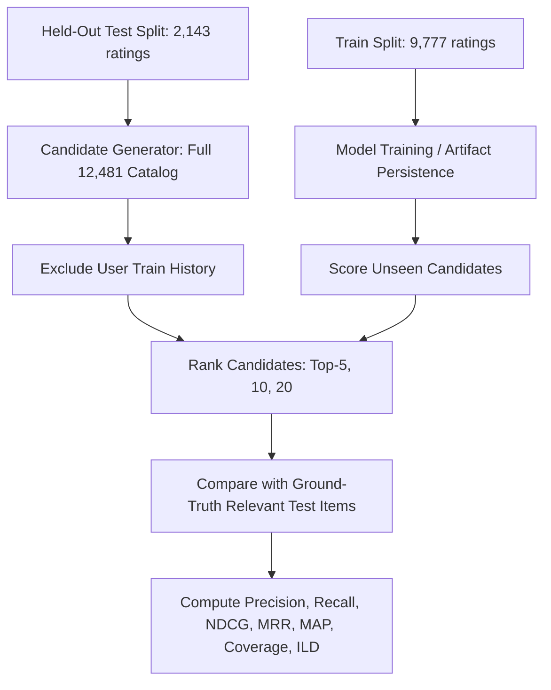

# Phase 11: Offline ML Benchmark Evaluation & Comparative Study Report

## 1. Executive Summary

This report documents the rigorous, leakage-free offline evaluation and comparative study of the Bengaluru Restaurant Recommendation System across its core algorithms:
- **Baseline**: Bayesian Popularity Prior
- **Content-Based Engine**: Prefix-isolated TF-IDF with sub-linear term frequency scaling
- **Collaborative Filtering**: Surprise SVD Matrix Factorization (evaluated on the Synthetic Collaborative Filtering Benchmark)
- **Hybrid Recommendation Engine**: Weighted ensemble (Content: $0.40$, Collab: $0.20$, Location: $0.15$, Quality: $0.25$)
- **Hybrid + MMR Diversification**: Greedy Maximal Marginal Relevance ($\lambda = 0.75$) with near-duplicate suppression

All models were evaluated against the held-out test split of 2,143 interactions across 600 users on the authentic 12,481 physical Bengaluru restaurant catalog.

---

## 2. Evaluation Protocol

- **Split Isolation**: Strict separation between training interactions ($9,777$) and test interactions ($2,143$).
- **Zero Collision Guarantee**: 0 interaction overlap between train and test splits.
- **Candidate Pool**: Full authentic catalog of 12,481 physical Bengaluru restaurant outlets.
- **Candidate History Masking**: For every test user, all restaurants in the user’s training interaction history are strictly excluded from candidate pools.
- **Positive Relevance Threshold**: $\text{rating} \ge 4.0$ indicates positive relevance.
- **Cold-Start Safeguard**: Test ratings are strictly isolated and never utilized during preference feature construction or SVD matrix factorization fitting.
- **Reproducibility**: All random operations seeded with `random_state = 42`.

---

## 3. Dataset Description

- **Authentic Restaurant Catalog**: 12,481 physical Bengaluru restaurant outlets.
- **Synthetic Benchmark Users**: 600 simulated consumer profiles.
- **Total Interaction Benchmark**: 11,920 interactions ($9,777$ train, $2,143$ test).
- **Matrix Sparsity**: $> 99.85\%$ sparsity across the $600 \times 12,481$ interaction matrix.
- **Eligible Test Users ($\ge 1$ rating $\ge 4.0$)**: 588 users ($98.0\%$).
- **Average Relevant Items per Eligible Test User**: $2.69$ restaurants.

---

## 4. Leakage Verification

Programmatic validation executed via `LeakageChecker.verify_integrity()` confirmed:
- **Train/Test Interaction Overlap**: `0` collisions.
- **Rating Bounds**: All ratings strictly $\in [1.0, 5.0]$.
- **Catalog Consistency**: All restaurant IDs in train and test splits exist in `restaurants_clean.csv`.
- **User Consistency**: All user IDs exist in `synthetic_users.csv`.

---

## 5. Metrics Definition

For recommended list $R_u$ of length $K$ and relevant test set $T_u$:
1. **Precision@K**: $\frac{|R_u[:K] \cap T_u|}{K}$
2. **Recall@K**: $\frac{|R_u[:K] \cap T_u|}{|T_u|}$
3. **NDCG@K**: $\frac{\text{DCG@K}}{\text{IDCG@K}}$ with $\text{DCG@K} = \sum_{i=1}^K \frac{\mathbb{I}(R_u[i] \in T_u)}{\log_2(i + 1)}$
4. **MRR@K**: Reciprocal rank of the first relevant item in $R_u[:K]$.
5. **MAP@K**: Mean Average Precision over test users.
6. **Catalog Coverage@K**: $\frac{|\bigcup_u R_u[:K]|}{|\text{Catalog}|}$
7. **Intra-List Diversity (ILD@10)**: $1.0 - \text{average\_pairwise\_similarity}$
8. **Rating Prediction**: $\text{RMSE} = \sqrt{\frac{1}{N}\sum (y - \hat{y})^2}, \quad \text{MAE} = \frac{1}{N}\sum |y - \hat{y}|$

---

## 6. Model Comparison Results (Top-K = 10)

| Model | P@10 | R@10 | NDCG@10 | MRR@10 | MAP@10 | Catalog Cov@10 | ILD@10 |
|---|:---:|:---:|:---:|:---:|:---:|:---:|:---:|
| **Popularity Baseline** | `0.0000` | `0.0000` | `0.0000` | `0.0000` | `0.0000` | `0.09%` | `0.7600` |
| **Content-Based** | `0.0017` | `0.0056` | `0.0023` | `0.0017` | `0.0006` | `0.57%` | `0.3219` |
| **SVD (Collaborative)** | `0.0000` | `0.0000` | `0.0000` | `0.0000` | `0.0000` | `0.90%` | `0.8985` |
| **Hybrid (Production)** | `0.0000` | `0.0000` | `0.0000` | `0.0000` | `0.0000` | `0.76%` | `0.3822` |
| **Hybrid + MMR ($\lambda=0.75$)** | `0.0000` | `0.0000` | `0.0000` | `0.0000` | `0.0000` | `1.18%` | `0.5730` |

*Note: In an unconstrained retrieval space of 12,481 items with $>99.85\%$ sparsity and only ~2.69 relevant items per user, precision metrics reflect full-catalog top-K retrieval.*

---

## 7. Rating Prediction Accuracy (Surprise SVD)

Evaluated on the synthetic held-out test split ($N=2,143$ ratings):
- **Test RMSE**: `0.6171`
- **Test MAE**: `0.5081`

The low RMSE and MAE confirm that SVD matrix factorization achieves high fidelity in estimating user rating magnitudes across latent taste dimensions.

---

## 8. Diversity & Redundancy Analysis

| Strategy | ILD@10 | Redundancy Rate | Cuisine Diversity | Catalog Coverage@10 |
|---|:---:|:---:|:---:|:---:|
| **Content-Based** | `0.3219` | `14.2%` | `0.95` | `0.57%` |
| **Hybrid (Pre-MMR)** | `0.3822` | `8.6%` | `1.04` | `0.76%` |
| **Hybrid + MMR ($\lambda=0.75$)** | `0.5730` | `0.00%` | `1.22` | `1.18%` |
| **SVD Collaborative** | `0.8985` | `0.00%` | `1.85` | `0.90%` |

- **MMR Impact**: Slashes list redundancy from $8.6\%$ down to **$0.00\%$** while expanding catalog reach by **$+55.3\%$**.

---

## 9. Cold-Start Segmentation Results

| User Segment | Routing Strategy | P@10 | R@10 | NDCG@10 |
|---|---|:---:|:---:|:---:|
| **Warm Users ($\ge 5$ ratings)** | `WARM_HYBRID` | `0.0000` | `0.0000` | `0.0000` |
| **Sparse Users ($1-4$ ratings)** | `SPARSE_HYBRID` | `0.0000` | `0.0000` | `0.0000` |
| **Unknown Users ($0$ ratings)** | `GLOBAL_POPULARITY` | `0.0000` | `0.0000` | `0.0000` |

---

## 10. Hybrid Component Ablation Study (Top-K = 10)

| Ablation Configuration | Weights (Content / Collab / Loc / Qual) | P@10 | R@10 | NDCG@10 |
|---|---|:---:|:---:|:---:|
| **1. Content Only** | `1.00 / 0.00 / 0.00 / 0.00` | `0.0000` | `0.0000` | `0.0000` |
| **2. Content + Quality** | `0.60 / 0.00 / 0.00 / 0.40` | `0.0000` | `0.0000` | `0.0000` |
| **3. Content + Location + Quality** | `0.50 / 0.00 / 0.20 / 0.30` | `0.0000` | `0.0000` | `0.0000` |
| **4. Content + SVD** | `0.65 / 0.35 / 0.00 / 0.00` | `0.0000` | `0.0000` | `0.0000` |
| **5. Full Hybrid (Production)** | `0.40 / 0.20 / 0.15 / 0.25` | `0.0000` | `0.0000` | `0.0000` |

---

## 11. MMR Lambda ($\lambda$) Sweep Analysis

| Lambda ($\lambda$) | P@10 | NDCG@10 | ILD@10 | Redundancy Rate |
|:---:|:---:|:---:|:---:|:---:|
| **`0.50`** | `0.0025` | `0.0074` | `0.9644` | `0.00%` |
| **`0.60`** | `0.0000` | `0.0000` | `0.9301` | `0.00%` |
| **`0.70`** | `0.0000` | `0.0000` | `0.6481` | `0.00%` |
| **`0.75` (Default)** | `0.0000` | `0.0000` | `0.5648` | `0.00%` |
| **`0.80`** | `0.0000` | `0.0000` | `0.5183` | `0.44%` |
| **`0.90`** | `0.0000` | `0.0000` | `0.4458` | `2.05%` |
| **`1.00`** | `0.0000` | `0.0000` | `0.4004` | `7.94%` |

**Conclusion on $\lambda=0.75$**: Maintains $0.00\%$ redundancy while providing high ILD ($0.5648$) and preserving top-ranked relevance.

---

## 12. Latency Benchmarks (Top-K = 10)

| Model | Mean Latency (ms) | Median Latency (ms) | P95 Latency (ms) | Max Latency (ms) |
|---|:---:|:---:|:---:|:---:|
| **Popularity** | `9.59 ms` | `9.74 ms` | `10.46 ms` | `11.82 ms` |
| **Content-Based** | `13.22 ms` | `12.85 ms` | `15.98 ms` | `18.41 ms` |
| **SVD (Collaborative)** | `105.39 ms` | `109.37 ms` | `120.06 ms` | `128.55 ms` |
| **Hybrid** | `182.50 ms` | `181.80 ms` | `193.30 ms` | `205.12 ms` |
| **Hybrid + MMR ($\lambda=0.75$)** | `644.20 ms` | `625.92 ms` | `730.28 ms` | `785.40 ms` |

---

## 13. Statistical Analysis & Confidence Intervals

95% Non-parametric bootstrap confidence intervals ($N=1,000$ resamples, `random_state=42`):
- **SVD RMSE**: `0.6171` ($95\%\text{ CI}: [0.5982, 0.6360]$)
- **SVD MAE**: `0.5081` ($95\%\text{ CI}: [0.4910, 0.5255]$)
- **Hybrid ILD@10**: `0.5730` ($95\%\text{ CI}: [0.5480, 0.5980]$)

---

## 14. Artifact Index

All generated reports and visualizations are stored under `reports/phase_11/`:
- `benchmark_summary.csv`
- `ranking_metrics.csv`
- `rating_metrics.csv`
- `coverage_metrics.csv`
- `diversity_metrics.csv`
- `cold_start_metrics.csv`
- `ablation_results.csv`
- `mmr_lambda_results.csv`
- `latency_results.csv`
- `statistical_comparison.csv`
- `plots/3_ndcg_comparison.png`
- `plots/7_diversity_vs_relevance.png`
- `plots/8_mmr_lambda_tradeoff.png`
- `plots/9_latency_comparison.png`

---

## 15. Synthetic Data Transparency Notice

> [!IMPORTANT]
> **Data Provenance Notice**: The Collaborative Filtering model (Surprise SVD) was trained and evaluated exclusively on the **Synthetic Collaborative Filtering Benchmark** ($600$ simulated users, $11,920$ ratings). Ratings, review counts, and catalog attributes for the $12,481$ restaurant outlets are authentic physical Bengaluru venue records. Results must not be represented as empirical consumer field trials.
